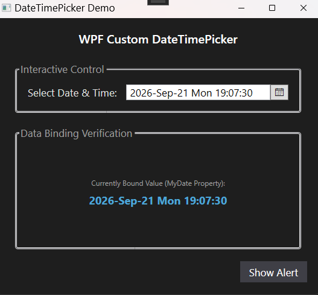

# WPF Custom DateTimePicker

A modern, lightweight, and fully custom `DateTimePicker` control for Windows Presentation Foundation (WPF). This control solves the classic WPF limitation of needing separate components for date and time by combining them into a single, keyboard-navigable, and null-safe interface with robust two-way data binding.



## Features

* **Unified Date & Time Selection:** Combines a traditional calendar dropdown with a precise text-based time editor (formatting: `yyyy-MMM-dd ddd HH:mm:ss`).
* **Intuitive Keyboard Navigation:** Use `Arrow Keys` to seamlessly traverse and increment/decrement individual date components, or type digits directly into the fields.
* **MVVM Ready:** Exposes a custom `SelectedDate` Dependency Property for seamless, reliable two-way binding.
* **Null-Safe Parsing:** Automatically handles invalid user inputs, gracefully falling back to valid dates or midnight defaults without crashing.
* **Clean Integration:** Built with standard XAML structures and transparent backgrounds, allowing it to neatly inherit parent window layouts and blend seamlessly into your existing application.

## Getting Started

### Prerequisites
* .NET 10.0
* Visual Studio 2022

### Installation & Usage

1. Clone the repository and reference the `WPF-DateTimePickerControl` project in your solution.
2. Add the XML namespace reference to your target Window or UserControl:
   ```xml
   xmlns:dtp="clr-namespace:WPF_DateTimePickerControl;assembly=WPF-DateTimePickerControl"
